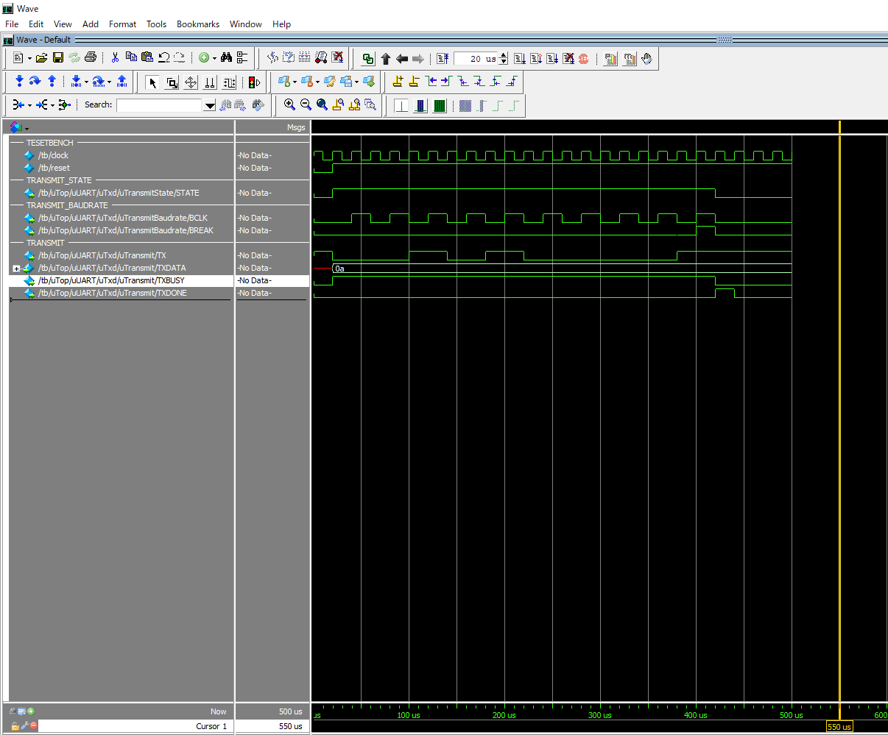
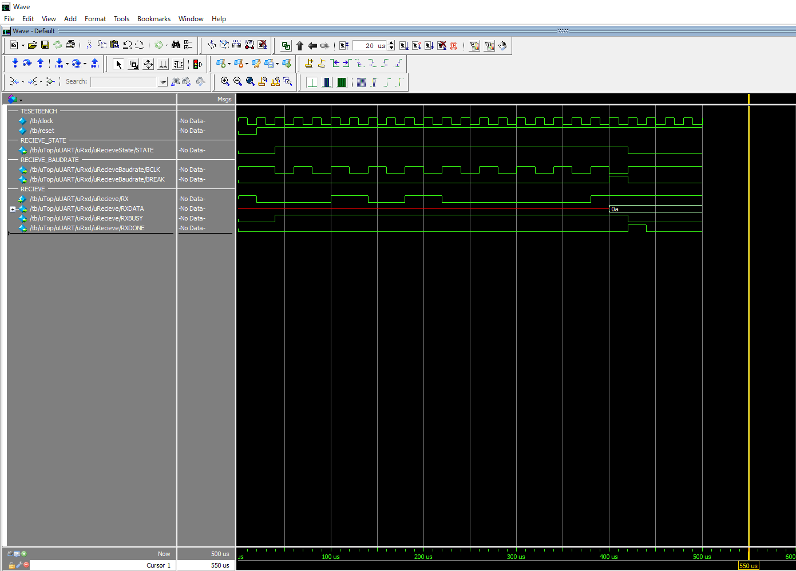

# aiFPGAs
AIモデルをFPGAに組み込む目的としている
# FPGA 環境 (Intel(旧Altera) MAX10 10M08SAE144C8G)

# [IEEE754 Floating-Point Arithmetic](VerilogHDLSources/FLOATING)
Simulation Pattern  
Clock: 100
BaudRate: 50  
TestBench: 
- [Floating tb.v](VerilogHDLSources/FLOATING/Simulation/Floating/TestBench/tb.v)

ModelSim Run Do Command:
- [tb.do](VerilogHDLSources/FLOATING/Simulation/Floating/ModelSim/tb.do)

Floating 32Bit Sources : [floating.v](VerilogHDLSources/FLOATING/Sources/floating.v)

★ Result Image
 

# [UART Module (VerilogHDL)](VerilogHDLSources/UART)
Simulation Pattern  
Clock: 100
BaudRate: 50  
TestBench: 
- [Uart tb.v](VerilogHDLSources/UART/Simulation/TestBench/tb.v)  

ModelSim Run DO Command:  

- [Transmit.do](VerilogHDLSources/UART/Simulation/ModelSim/transmit.do)  
- [Recieve.do](VerilogHDLSources/UART/Simulation/ModelSim/recieve.do)  

★ Transmit TimingCharts  

  

★ Recieve TimingCharts  

  

★ Uart TimingCharts  

  

