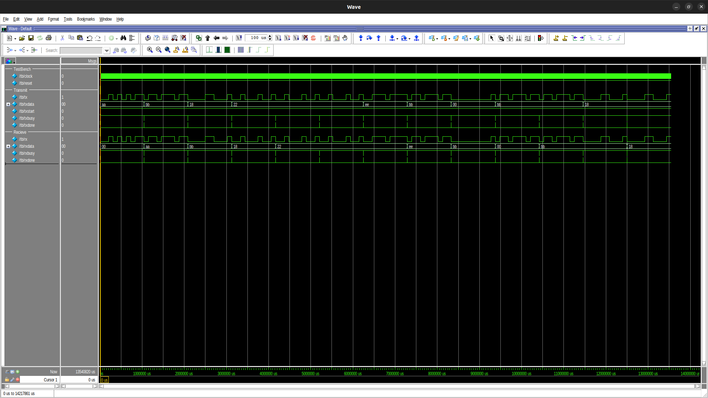
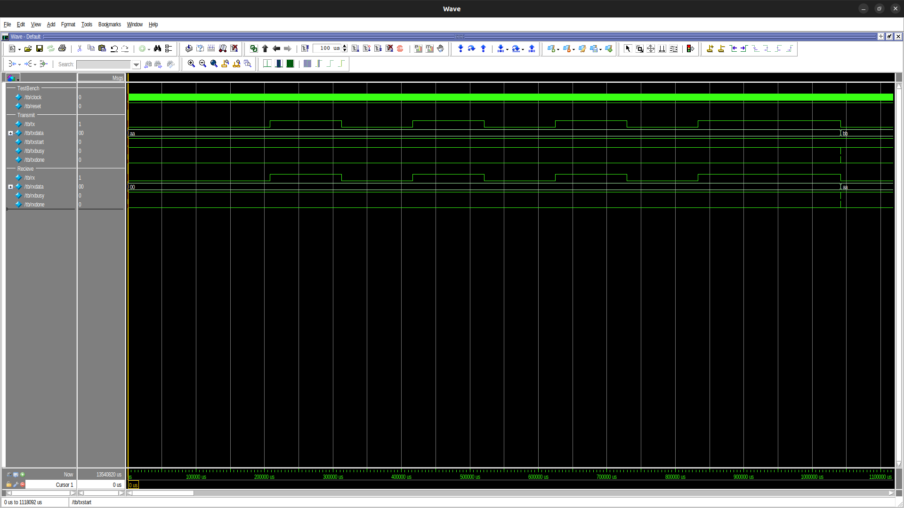

# aiFPGAs
★ AIモデルをFPGAに組み込む目的としている ★
# FPGA 環境 (Intel 旧Altera MAX10 10M08SAE144C8G)

# [IEEE754 Floating-Point Arithmetic](VerilogHDL/floating.v)
# [Custom Floating-Point Arithmetic](VerilogHDL/floating.v)

# [UART Module (VerilogHDL)](VerilogHDL/uart.v)
### ~~ Simulation ~~ 
Clock: 50MHz  
BaudRate: 9600  
Module:
[uart.v](VerilogHDL/uart.v)  
TestBench:
[tb.v](ModelSim/UART/TestBench/tb.v)   
Do File:
[tb.do](ModelSim/UART/Simulation/tb.do)  
Uart Top TimingChart

Uart Transmit and Recieve TimingChart

